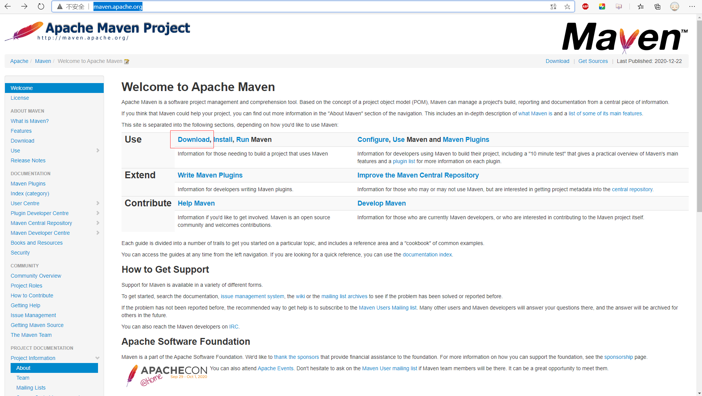
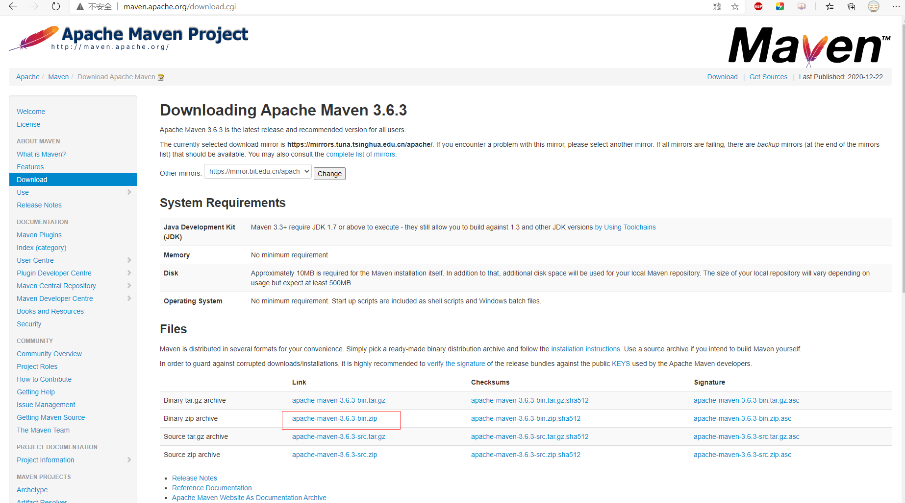
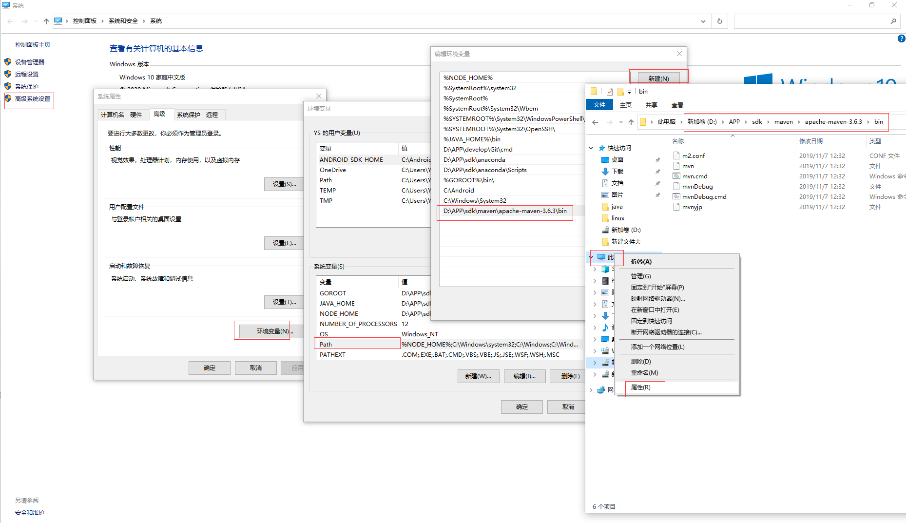
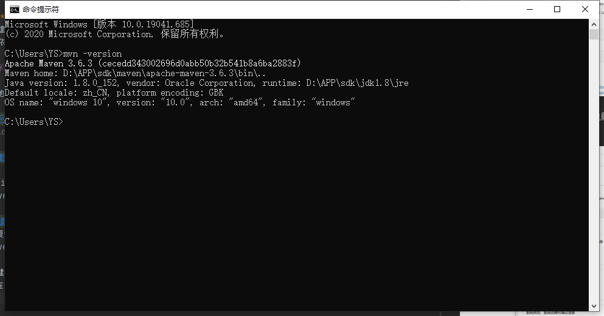

# Maven项目依赖管理

## 概述
**Maven:** 一个用于自动化构建项目和管理项目依赖的工具  
**自动化构建项目：** 按照企业中主流的项目模板，创建完善的项目结构  
**管理项目依赖：** 配置式添加管理，自动下载和导入  

## Maven环境配置

### Maven下载
Maven官网地址：[http://maven.apache.org](http://maven.apache.org)


点击`Download`跳转Maven下载界面  



### Maven环境变量配置
下载最新版zip即可，将下载后的zip包解压到本地任意文件夹下  
然后打开maven解压后生成的文件夹，进入到bin目录下，复制路径地址


如图所示，复制路径之后，右键我的电脑，点击属性 -> 高级系统设置 -> 环境变量 -> Path -> 新建  
将复制的Maven路径黏贴到对应位置，点击确定关闭所有对话框

win+R快捷键，输入`cmd`打开Windows10命令行，输入：`mvn -version`  
注：一定要在保存环境变量后新打开的命令窗口输入，否则不生效；  


### Maven本地仓库配置
Maven下载jar包默认是下载到C盘用户目录下的.m2文件夹下的，会大量占用C盘空间  
打开Maven文件夹下的`conf`文件夹，找到`settings.xml`文件，将其打开，在settings标签内增加`localRepository`标签，指定jar包下载位置（本地仓库位置）：  
```xml
<settings xmlns="http://maven.apache.org/SETTINGS/1.0.0"
          xmlns:xsi="http://www.w3.org/2001/XMLSchema-instance"
          xsi:schemaLocation="http://maven.apache.org/SETTINGS/1.0.0 http://maven.apache.org/xsd/settings-1.0.0.xsd">
  <!-- localRepository
   | The path to the local repository maven will use to store artifacts.
   |
   | Default: ${user.home}/.m2/repository
  <localRepository>/path/to/local/repo</localRepository>
  -->
    <localRepository>D:\repository</localRepository>
</settings>
```
### Maven配置远程阿里云仓库
Maven默认远程仓库是在国外的，由于网络原因，有时会导致下载jar包特别慢或者下载失败或者下载残缺，从而引起一些奇奇怪怪的问题，可以通过配置更改远程仓库位置，指向国内阿里云仓库  
在Maven文件夹下的`conf`文件下的`settings.xml`文件中`mirrors`标签中做如下配置即可
```xml
 <mirrors>
	<mirror>
		<id>nexus-aliyun</id>
		<name>Nexus aliyun</name>
		<url>http://maven.aliyun.com/nexus/content/groups/public/</url> 
		<mirrorOf>central</mirrorOf> 
	</mirror>
  </mirrors>
```

### Maven依赖添加
使用工具创建Maven项目后，会在目录下有一个pom.xml文件，只需要在文件中的`dependencies`标签中增加对应的依赖引入，maven即可完成对应的关联  
Maven依赖查询网址：[https://mvnrepository.com](https://mvnrepository.com)

## Maven基础知识讲解

### Maven仓库
1. 远程仓库/中央仓库
2. 本地仓库
3. 私有服务器