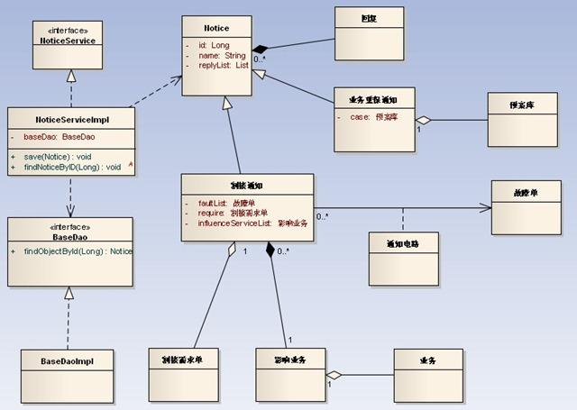
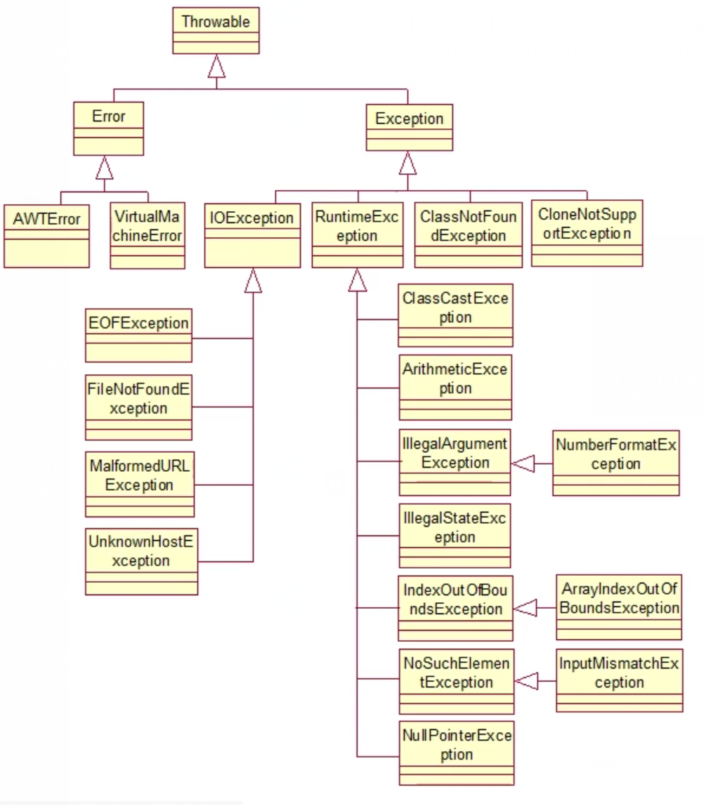
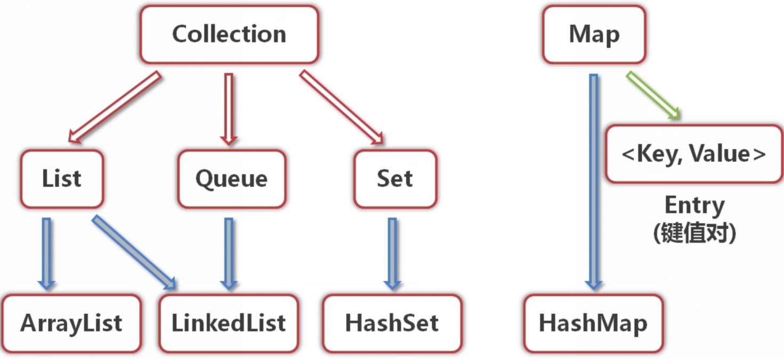

# java基础-面向对象

### 什么是对象
1. **对象：** 万物皆对象，只要是客观存在的事物皆为对象  
2. **面向对象：** 人关注着一个对象，或者称为，人关注一个具体事物的信息  
例如：想要去买一个手机，售货员询问你想要一个什么样的手机，你描述了一下自己的需求，此时你的描述只是一个虚构，不能称之为对象，因为它并不存在，然后售货员拿过来一个手机，而这个手机就是对象。  

> 售货员首先让你描述了一下你所需要的东西，可以把这个描述称为类  
> 类是模子，确定对象将会拥有的特征（属性）和行为（方法）  

3. **类的特点：** 类是对象的类型，具有相同属性和方法的一组对象的集合（类在客观世界中是不存在的，但程序关注的是是数据，需要一个描述让程序知道这个类，可以将相同属性和方法对象用一个类来表示，也就是一个类可以表示多个对象）  

4. **属性：** 对象具有的各种特征，每个对象的每个属性都拥有特定值（比如上面说的买手机，每个手机都有CPU、屏幕、内存等等，每个手机的CPU都有自己的型号，屏幕的尺寸，内存的大小等等，会有一个特定的值，这个值就是属性）  

5. **方法：** 对象执行的操作或者说能做什么（比如打电话，发短信，上网等等）  

类和对象的关系：类是抽象的概念，仅仅是模板，比如手机类，只是一个描述，没有具体的实体，当他具象化到某一个部手机上的时候，就成了对象，对象是一个你能看得到摸得着的具体实体

### 类
1. **类的重要性：** 所有的java程序都以类class为组织单元  
2. **类的组成：** 属性和方法
3. **定义一个类的步骤：**  
    + 定义类名
    + 编写类的属性
    + 编写类的方法

4. **使用一个对象的步骤：** 
    + 创建一个对象  
        类名 对象名 = new 类名();
    + 使用对象  
        引用对象的属性：对象名.属性  
        引用对象的方法：对象名.方法

### 成员变量和局部变量
1. 成员变量   
   在类中定义，用来描述对象将要有什么；成员变量可以被本类中的所有方法使用，也可以被相关其他类中的方法调用
2. 局部变量  
   在类的方法中定义，在方法中临时保存数据；局部变量只能被本方法使用
3. 成员变量和局部变量区别    
   + **作用域不同**  
        局部变量的作用域仅限于定义它的方法  
        成员变量的作用域在整个类内部都是可见的  
   + **初始值不同**   
        java会给成员变量一个初始值  
        java不会给局部变量赋予初始值
    + 在同一个方法中，不允许有同名的局部变量  
       在不同的方法中，可以有同名的局部变量
    + 两类变量同名，局部变量具有更高的优先级（就近原则）  
    

### 构造方法
1. 使用new + 构造方法，创建一个对象  
2. 构造方法是定义在java类中的一个用来初始化对象的方法
3. 构造方法与类同名，且没有返回值  
4. 构造方法可以有参数，也可以没有参数（有参的构造方法主要是用来初始化成员变量）
5. 档没有指定构造方法时，系统会自动添加无参的构造方法
6. 当有指定构造方法，无论是有参、无参的构造方法，系统都不会再自动添加无参构造方法  
7. 构造方法的重载：方法名相同，但参数不同的对个方法，调用时会自动根据不同的参数选择相应的方法  
8. 构造方法不但可以给对象的属性赋值，还可以保证给对象的属性赋一个合理的值  


## 面向对象的特性
> 面向对象三大特性：封装，继承，多态

### 封装
1. **概念：**
    将类的某些信息隐藏在类的内部，不允许外部程序直接访问，而是通过该类提供的方法来实现对隐藏信息的操作和访问。
2. **好处：**
    + 只能通过规定的方法访问数据  
    + 隐藏类的实现细节，方便修改和实现
3. 封装的实现步骤
    + 修改属性的可见性（设为private）
    + 创建getter/setter方法（用于属性的读写）
    + 在getter/setter方法中加入属性控制语句（对属性值和合法性进行判断）

### Java中的包
1. 包的作用：
    + 管理java文件
    + 解决同名文件冲突
    
2. 定义包：package报名
    + 注：必须放在java源程序的第一行
    + 包名间可以使用“.”号隔开
    
3. 包的使用：
    + 可以通过import关键字，在某个文件使用其他文件中的类。
    + java中，包的命名规范是全小写字母拼写
    
### java中的访问修饰符

> 访问修饰符---可以修饰属性和方法的访问范围

| 访问修饰符 | 本类 | 同包 | 子类 | 其他 |
| ---- | ---- | ---- | ---- | ---- |
| private | √ |   |   |   |
| 默认 | √ | √ |   |   |
| protected | √ | √ | √ |   |
| public | √ | √ | √ | √ |


### Java中的this关键字
1. this关键字代表当前对象
    + this.属性   操作当前对象的属性
    + this.方法   操作当前对象的方法
    
2. 封装对象属性的时候，经常会使用this关键字  

### 继承
1. 继承的概念:
    + 继承是类与类的一种关系，是一种“is a”的关系
    + 注：Java中的继承是单继承
    
2. 继承的好处：
    + 子类拥有父类的所有属性和方法（private修饰符修饰的方法和属性无效）
    + 实现代码复用
    
3. 语法规则：
    + class 子类 extends 父类
    
4. 继承的初始化顺序
    + 先初始化父类再初始化子类
    + 先执行初始化对象中属性，再执行构造方法中的初始化
> 创建一个子类对象的时候，会先执行父类属性的初始化，然后是父类构造方法，然后是子类属性初始化，然后是子类构造方法

 
### 方法的重写
1. 什么是方法重写：
    + 如果子类对继承父类的方法不满意，是可以重写父类继承的方法的，当调用方法时会有限调用子类的方法

2. 语法规则： 
    + 返回值类型，方法名，参数类型及个数，都要与父类继承的方法相同，才叫方法的重写

### final关键字
> 使用final关键字做标识有"最终的"含义  

final可以修饰类、方法、属性、和变量
 + final修饰类：则该类不允许被继承
 + final修饰方法：则该方法不允许被覆盖（重写）
 + final修饰属性：则该类的属性不会进行隐式的初始化（类的舒适化属性必须有值），或在构造方法中赋值（但只能选择其一）
 + final修饰变量：则该变量的值只能赋一次值，即变为常量


### super关键字
> 在对象的内部使用，可以代表父类对象
 
1. 访问父类的属性
    + super.age
    
2. 访问父类的方法
    + super.eat()
    
3. 子类的构造方法中会调用父类的构造方法，使用super(),如果子类构造方法中没有显示调用父类的构造方法，则系统默认调用父类无参的狗杂种方法；如果显示的调用父类的构造方法，必须在子类的构造方法的第一行

4. 如果子类构造方法中即没有显示的调用父类的构造方法，而父类又没有无参构造方法，则编译报错

### Object类
> Object类是所有类的父类，如果一个类没有使用extends关键字明确标识继承另外一个类，那么这个类默认继承Object类。  
> Object类中的方法，适合所有子类。

1. toString()方法
    + 在Object类里面定义toString()方法的时候返回的对象是哈希code码（对象地址字符串）
    + 可以通过重写toString()方法表示出对象的属性
    
2. equals()方法
    + 比较的是对象的引用是否指向同一块内存地址
    + 一般情况下比较两个对象时比较他的值是否一致，所以要进行重写
    

### 多态
> 对象的多种形态
> 程序运行过程中，对象角色的切换
> 程序运行过程中，对象行为的扩展

1. 引用的多态
   + 父类的引用可以指向本类的对象
   + 父类的引用可以指向子类的对象
    
2. 方法的多态
   + 创建本类对象时，调用的方法为本类方法
   + 创建子类对象时，调用的方法为子类重写的方法或者继承的方法
    

###引用类型转换

1. 向上类型转换（隐式/自动类型转换），是小类型到大类型的转换（无风险）
2. 向下类型转换（强制类型转换），是大类型到小类型（有风险）
3. instanceof运算符，来解决引用对象的类型，避免类型转换的安全问题


### 抽象类
1. 语法定义：
   + 抽象类前使用abstract关键字修饰，则该类为抽象类
   
2. 应用场景：
   + 在某些情况下，某个父类只是知道其子类应该包含怎样的方法，但是无法准确知道这些子类如何实现这些方法。（约束子类必须有哪些方法，并不关注子类是怎么实现的）
   + 从多个具有相同特征的类中抽象出一个抽象类，以这个抽象类作为子类的模板，从而避免子类设计的随意性。
   
3. 作用：
   + 限制子类必须实现某些方法，但不关注实现细节
   
4. 使用规则：
   + abstract定义抽象类
   + abstract定义抽象方法，只有声明，不需要实现。（抽象方法没有方法体，以分号结束）
   + 包含抽象方法的类必须是抽象类
   + 抽象类中可以包含普通方法，也可以没有抽象方法
   + 抽象类不能直接创建，可以定义引用变量


### 接口

1. 接口概念：
   + 类似一种具体实现体，而接口定义了某一批类所需要准守的规范，接口不关心这些类的内部数据，也不关心这些类里方法的实现细节，它只规定这些类里面必须提供某些方法。
   
2. 接口定义：
   + 和类定义不同，定义接口不再使用class关键字，而是使用interface关键字。

3.接口定义的基本语法;
   + [修饰符] interface 接口名 [extends 父接口1，父接口2] {零到多个常量定义...   零到多个抽象方法定义...}
   + 接口就是永磊被继承、被实现的，修饰符一般建议使用public
   + 注意：不能使用private和protectde修饰接口 

4. 接口定义：  
   常量：
    + 接口中的属性是常量，即使定义时不添加public static final 修饰符，系统也会自动加上。
   方法：  
    + 接口中的方法只能是抽象方法，即使定义时不添加public abstract修饰符，系统也会自动加上。
   
5. 使用接口：
   + 一个类可以实现一个或者多个接口，实现接口使用implements关键字，java中一个类只能继承一个父类，是不够灵活的，通过实现多个接口可以做补充。
   + 接口在使用过程中，还经常与匿名内部类配合使用。（匿名内部类就是没有名字的内部类，多用于关注实现而不关注实现类的名称）
   
> 继承父类实现接口的语法为：
> [修饰符] class 类名 extends 父类 implements 接口1，接口2...{
>  类体部分/如果继承了抽象类，需要实现继承的抽象类方法，需要实现接口中的抽象方法。
> }
> 如果继承父类，继承父类必须在实现接口之前


### UML

1. UML概念：
   + Unified Modeling Language（UML）
   + 又称同意建模语言或标准建模语言
   + 是一个支持模型化和软件系统开发的图形化语言
   + 为软件开发的所有阶段提供模型化和可视化支持
   
2. UML图示：
   UML2.2中一共定义了14中图示（diagrams）
   
   
3. 常用UML图
   + 用例图（The Use Case Diagram）
      用例图能够以可视化的方式，表达系统如何满足所收集的业务规则，以及特定的用户需求等信息
   + 序列图（The Sequence Diagram）
      序列图用于按照交互发生的一系列顺序，显示对象之间的这些交互关系
   + 类图（The Class Diagram）
      UML类图、业务逻辑和所有支持结构一同被用于定义，全部的代码逻辑


### 数据模型分析

1. 通过对现实世界的事物与主要特征的分析、抽象，为信息系统的实施提供数据存取的数据结构以及相应的约束。
2. 数据结构组成：操作（方法），属性。

### 业务模型分析
1. 在设计应用程序之前，应该明确该应用程序必须执行那些任务。
   + 分析业务需求是应用程序开发中最重要的步骤之一
   + 确认业务需求的目的在于创建一个能同时满足零售和消费者需要的解决方案
   
### 显示和流程分析
1. 显示：用户可以看到的信息提示界面。
2. 流程： 显示信息的执行过程、步骤。


## 异常

> 有异于常态，和正常情况不一样，有错误出现
> 阻止当前方法或作用域，称之为异常

```
java中的异常都是继承于Throwable类，其下主要分为两大类，Error和Exception，Error比较少见，一般指系统错误如虚拟机错误，系统内存溢出等等，一般很难通过代码层面解决；Exception异常一般指程序编码出现问题，或者环境出现问题，或者用户操作输入出现问题，可以通过修改代码逻辑进行解决；Exception下面又分为两种，非检查异常（RuntimeException）和检查异常
```




**异常处理：**  
try-catch 以及 try-catch-finally

**throw：** --- 将产生的异常抛出（动作，在方法体重）  
**throw：** --- 声明将要抛出何种类型的异常（声明，在方法名后面）

自定义异常：自定义异常，要么继承用处相近的异常，要么继承所有异常的基类Exception
> class 自定义异常类 extends 异常类型 {
> 
> }

java异常链：  
> 捕获一种异常，将其封装为另外一种异常抛出，新异常中会含有原异常的所有信息


## 集合

### 集合的概念
> 现实生活中：很多的事物凑在一起
> 数学中的集合：具有共同属性的事物的总体
> java中的集合类：是一种工具类，就像是容器，存储任意数量的具有共同属性的对象

### 集合的作用
1. 在类的内部，对数据进行组织
2. 简单而快速的搜索大数据量的条目
3. 有的集合接口，提供了一系列排列有序的元素，并且可以在序列中间快速的插入或者删除元素
4. 有的集合接口，提供了映射关系，可以通过关键字（key）去快速查找到对应的唯一对象，而这个关键字可以是任意类型


**与数组的对比----为什么选择集合而不是数组**  
1. 数组的长度是固定的，集合长度可变
2. 数组只能通过下标访问元素，类型固定，而有的集合可以通过任意类型查找所映射的具体对象



注：本图只是用来展示集合之间的关系，并没有列出所有集合类型

### Collection接口、子接口以及实现类

Collection接口：
   1. 是List、Set、和Queue接口的父接口
   2. 定义了可用于操作List、Set、和Queue的方法----增删改查

List接口及其实现类---ArrayList
   1. List是元素有序并且可以重复的集合，被称为有序集合
   2. List可以精确的控制每个元素的插入位置，或者删除某个位置元素
   3. ArrayList----数组序列，是List的一个重要实现类
   4. ArrayList底层是由数组实现的


Set接口及其实现类----HashSet
   1. Set是元素无序并且不可以重复的集合，被称为集
   2. HashSet----哈希集，是Set的一个重要实现类

### 泛型

集合中的元素，可以是任意类型的对象（对象的引用）  
   + 如果把某个对象放入集合，则会忽略他的类型，而把他当做Object处理  

泛型则是规定了某个集合只可以存放特定的对象    
   + 会在编译期间进行类型检查  
   + 可以直接按指定类型获取集合元素
   + 泛型集合中的限定类型不能使用基本数据类型
   + 可以通过使用包装类限定允许存入的基本数据类型


### Map和HashMap
Map接口：  
   1. Map接口提供了一种映射关系，其中的元素是以键值对（key-value）的形式存储的，能够实现根据Key快速查找value
   2. Map中的键值对以Entry类型的对象实例形式存在
   3. 键（key值）不可重复，value值可以重复
   4. 每个键最多只能映射到一个值
   5. Map支持泛型，形式如：Map<K,V>

HashMap类：
   1. HashMap是Map的一个重要实现，也是最常用的，基于哈希表实现
   2. HashMap中的Entry对象是无序排列的
   3. Key值和value值都可以为null，但是一个HashMap只能有一个key值为null的映射(key值不能重复)


### Comparable和Comparator

Comparable接口----可比较的：
   1. 实现该接口表示：这个类的实例可以比较大小，可以进行自然排序
   2. 定义了默认的比较规则
   3. 其实现类需要实现compareTo()方法
   4.compareTo()方法返回正数表示大，负数表示小，0表示相等

Comparator接口----比较工具接口：
   1. 用于定义临时比较规则，而不是默认比较规则
   2. 其实现类需要实现compare()方法
   3. Comparable和Comparator都是Java集合框架的成员
