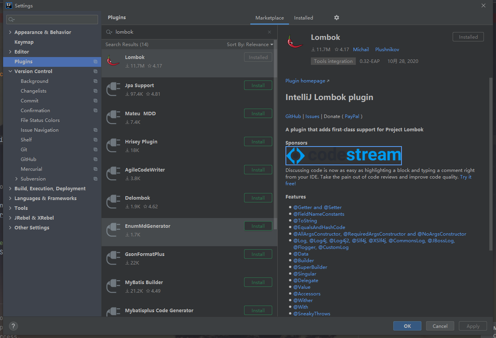

# Lombok常用注解

以前的Java项目中充斥了太多不友好的代码：POJO的Getter/Setter/toString等等，这些代码由于没有什么技术含量，影响了代码的美观等缺点，让Lombok应运而生。

## 安装Lombok

### 加入Maven依赖
```xml
<dependency>
    <groupId>org.projectlombok</groupId>
    <artifactId>lombok</artifactId>
    <optional>true</optional>
</dependency>
```

### IDEA中安装Lombok插件
依次点击：FIle-Settings-Plugins，从插件栏中搜索Lombok进行安装，安装之后勾选Lombok启动即可。


## 注解介绍

### @Getter和@Setter
放在类上，为该类的所有属性自动生成Getter方法和Setter方法

```java
import lombok.Getter;
import lombok.Setter;

/**
 * @author: YS
 * @create: 2020-12-17
 **/
@Getter
@Setter
public class Student {
    int id;
    String name;
    int age;
}
```

### ToString
自动重写ToString方法，和我们平时使用IDEA编辑器自动生成的一样

```java
/**
 * @author: YS
 * @create: 2020-12-17
 **/
@ToString
public class Student {
    int id;
    String name;
    int age;
}
```

### EqualsAndHashCode
自动生成equal(Object other)和hashCode()方法，如果某些变量不想加入该注解，可以使用exclude进行排除  
```java
import lombok.EqualsAndHashCode;

@EqualsAndHashCode
public class Student {
    int id;
    String name;
    int age;
}
```

```java
import lombok.EqualsAndHashCode;

//把name属性排除在外
@EqualsAndHashCode(exclude = "name")
public class Student {
    int id;
    String name;
    int age;
}
```
> 问：为什么把生成equal(Object other)和hashCode()方法弄成一个注解，而不是分开使用？
> 
> 答：在java中有规定：当两个对象相等时，他们的hashCode是一定相等的，但是，当两个对象的hashCode相同，对象不一定相等，这样做是为了防止违反java规定的情况发生

### @NoArgsConstructor
生成一个不包含任何参数的构造函数
```java
import lombok.NoArgsConstructor;

@NoArgsConstructor
public class Student {
    int id;
    String name;
    int age;
}
```

### @AllArgsConstructor
生成一个包含所有参数的构造器
```java
import lombok.AllArgsConstructor;

@AllArgsConstructor
public class Student {
    int id;
    String name;
    int age;
}
```

### @RequiredArgsConstructor
为“特定参数”生成构造器，这里的“特定参数”，特指那些加上final修饰词的属性
```java
import lombok.RequiredArgsConstructor;

@RequiredArgsConstructor
public class Student {
    int id;
    final String name;
    int age;

    public static void main(String[] args) {
        Student student = new Student("33");
    }
}
```
这里我们只为name加上final修饰，可以发现，我们只生成了一个包含name属性的构造器。另外，如果所有的属性都没有final修饰的话，使用@RequiredArgsConstructor会生成一个无参的构造器。  

### @Data
这是一个组合注解，加了这个注解，相当于加入了@Getter、@Setter、@ToString、@EqualsAndHashCode和@RequiredArgsConstructor这五个注解。

### @Value
这也是一个组合注解，但是会把所有的变量都设置为final的，其他的就和@Data一样了。等同于加入了@Getter、@ToString、@EqualsAndHashCode和@RequiredArgsConstructor这四个注解（由于所有属性是final的，所以没有@setter注解了）。

### @Builder
流式的set值写法，不过毕竟是给属性赋值，基本的setter还是需要有的，一般来说，@Builder会和@Data一起使用。
```java
import lombok.Builder;
import lombok.Data;

@Builder
@Data
public class Student {
    int id;
    String name;
    int age;

    public static void main(String[] args) {
    Student student = 							Student.builder().id(1).name("water").age(18).build();
	}
}
```

### @Slf4j
自动生成该类的log静态常量，就可以直接打印日志了，不用去new一个log的静态常量了。
```java
@Slf4j
public class Student {
    int id;
    String name;
    int age;

    public static void main(String[] args) {
        log.info("hello world");
    }
}
```


