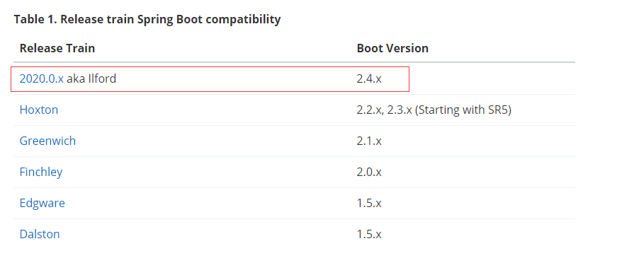

#尚硅谷SpringCloud-Alibaba(一)-版本概述

## 微服务概念
> 微服务架构是种架构模式，它提倡将单一应用程序划分成一组小的服务，服务之间互相协调、互相配合，为用户提供最终价值。
> 每个服务运行在其独立的进程中，服务与服务间采用轻量级的通信机制互相协作（通常是基于HPPT协议的RESTful API）。
> 每个服务都围绕着具体的业务进行构建，并且能够被独立的部署到生产环境、类生产环境等。
> 另外，应当尽量避免统一的、集中的服务管理机制，对具体的一个服务而言，应根据业务上下文选择合适的语言、工具对其进行构建。


指定springboot,springcloud的版本  


强烈推荐升级2.0以后


起步支持java 8,也支持java 9


截至2020-03-07,springboot最新版本为 2.2.5

但不一定要用最新的版本

springcloud 的 github 已经不维护

springcloud版本是根据英国地铁站A,B,C....H开头来命名


现在的最新版本 H打头版本

GA:General Availability,正式发布的版本，官方推荐使用此版本。在国外都是用GA来说明release版本的。

PRE: 预览版,内部测试版. 主要是给开发人员和测试人员测试和找BUG用的，不建议使用；

SNAPSHOT: 快照版，可以稳定使用，且仍在继续改进版本


如果你的springcloud是H版,那么springboot必须是2.2.x开始

准确技术选型:
[https://start.spring.io/actuator/info](https://start.spring.io/actuator/info)

复制json到格式化
[https://www.sojson.com/](https://www.sojson.com/)

```json
{
  "git": {
    "commit": {
      "time": "2020-03-04T08:56:03Z",
      "id": "2e0a39b"
    },
    "branch": "2e0a39bd17a9b775c359a0aa1d0eb685a7a3325a"
  },
  "build": {
    "version": "0.0.1-SNAPSHOT",
    "artifact": "start-site",
    "name": "start.spring.io website",
    "versions": {
      "initializr": "0.9.0.BUILD-SNAPSHOT",
      "spring-boot": "2.2.5.RELEASE"
    },
    "group": "io.spring.start",
    "time": "2020-03-04T08:57:12.160Z"
  },
  "bom-ranges": {
    "azure": {
      "2.0.10": "Spring Boot >=2.0.0.RELEASE and <2.1.0.RELEASE",
      "2.1.7": "Spring Boot >=2.1.0.RELEASE and <2.2.0.M1",
      "2.2.0": "Spring Boot >=2.2.0.M1"
    },
    "codecentric-spring-boot-admin": {
      "2.0.6": "Spring Boot >=2.0.0.M1 and <2.1.0.M1",
      "2.1.6": "Spring Boot >=2.1.0.M1 and <2.2.0.M1",
      "2.2.1": "Spring Boot >=2.2.0.M1"
    },
    "spring-cloud": {
      "Finchley.M2": "Spring Boot >=2.0.0.M3 and <2.0.0.M5",
      "Finchley.M3": "Spring Boot >=2.0.0.M5 and <=2.0.0.M5",
      "Finchley.M4": "Spring Boot >=2.0.0.M6 and <=2.0.0.M6",
      "Finchley.M5": "Spring Boot >=2.0.0.M7 and <=2.0.0.M7",
      "Finchley.M6": "Spring Boot >=2.0.0.RC1 and <=2.0.0.RC1",
      "Finchley.M7": "Spring Boot >=2.0.0.RC2 and <=2.0.0.RC2",
      "Finchley.M9": "Spring Boot >=2.0.0.RELEASE and <=2.0.0.RELEASE",
      "Finchley.RC1": "Spring Boot >=2.0.1.RELEASE and <2.0.2.RELEASE",
      "Finchley.RC2": "Spring Boot >=2.0.2.RELEASE and <2.0.3.RELEASE",
      "Finchley.SR4": "Spring Boot >=2.0.3.RELEASE and <2.0.999.BUILD-SNAPSHOT",
      "Finchley.BUILD-SNAPSHOT": "Spring Boot >=2.0.999.BUILD-SNAPSHOT and <2.1.0.M3",
      "Greenwich.M1": "Spring Boot >=2.1.0.M3 and <2.1.0.RELEASE",
      "Greenwich.SR5": "Spring Boot >=2.1.0.RELEASE and <2.1.14.BUILD-SNAPSHOT",
      "Greenwich.BUILD-SNAPSHOT": "Spring Boot >=2.1.14.BUILD-SNAPSHOT and <2.2.0.M4",
      "//": "这里看到H版本SR1对应的springboot版本为大于2.2.0.M小于2.2.6.BUILD-SNAPSHOT",
      "Hoxton.SR1": "Spring Boot >=2.2.0.M4 and <2.2.6.BUILD-SNAPSHOT",   
      "Hoxton.BUILD-SNAPSHOT": "Spring Boot >=2.2.6.BUILD-SNAPSHOT and <2.3.0.M1"
    },
    "spring-cloud-alibaba": {
      "2.2.0.RELEASE": "Spring Boot >=2.2.0.RELEASE and <2.3.0.M1"
    },
    "spring-cloud-services": {
      "2.0.3.RELEASE": "Spring Boot >=2.0.0.RELEASE and <2.1.0.RELEASE",
      "2.1.6.RELEASE": "Spring Boot >=2.1.0.RELEASE and <2.2.0.RELEASE",
      "2.2.1.RELEASE": "Spring Boot >=2.2.0.RELEASE and <2.3.0.M1"
    },
    "spring-data-r2dbc": {
      "0.1.0.M3": "Spring Boot >=2.2.0.M6 and <2.2.6.BUILD-SNAPSHOT",
      "0.1.0.BUILD-SNAPSHOT": "Spring Boot >=2.2.6.BUILD-SNAPSHOT"
    },
    "spring-statemachine": {
      "2.0.0.M4": "Spring Boot >=2.0.0.RC1 and <=2.0.0.RC1",
      "2.0.0.M5": "Spring Boot >=2.0.0.RC2 and <=2.0.0.RC2",
      "2.0.1.RELEASE": "Spring Boot >=2.0.0.RELEASE"
    },
    "vaadin": {
      "10.0.17": "Spring Boot >=2.0.0.M1 and <2.1.0.M1",
      "14.1.18": "Spring Boot >=2.1.0.M1"
    }
  },
  "dependency-ranges": {
    "okta": {
      "1.2.1": "Spring Boot >=2.1.2.RELEASE and <2.2.0.M1",
      "1.4.0": "Spring Boot >=2.2.0.M1"
    },
    "mybatis": {
      "2.0.1": "Spring Boot >=2.0.0.RELEASE and <2.1.0.RELEASE",
      "2.1.1": "Spring Boot >=2.1.0.RELEASE"
    },
    "geode": {
      "1.2.5.RELEASE": "Spring Boot >=2.2.0.M5 and <2.3.0.M1",
      "1.3.0.M2": "Spring Boot >=2.3.0.M1 and <2.3.0.BUILD-SNAPSHOT",
      "1.3.0.BUILD-SNAPSHOT": "Spring Boot >=2.3.0.BUILD-SNAPSHOT"
    },
    "camel": {
      "2.22.4": "Spring Boot >=2.0.0.M1 and <2.1.0.M1",
      "2.24.3": "Spring Boot >=2.1.0.M1 and <2.2.0.M1",
      "3.1.0": "Spring Boot >=2.2.0.M1"
    },
    "solace": {
      "3.1.0": "Spring Boot >=2.1.0.RELEASE and <2.2.0.M1",
      "3.2.0": "Spring Boot >=2.2.0.M1"
    }
  }
}
```
区间还是要选择,还是看官方推荐的


点击Reference Doc


springcloud对应boot版本一目了然

## 注：
我在学习springcloud alibaba视频时已经是2021年年初，springcloud稳定版本也已经迭代到了`2020.0.0`版本,为了体验最新版本，故后续是按照最新的版本配置进行学习。




```json
{
  "git": {
    "branch": "3e2ac1abc157e25c68b39b7e03b1bfc1e23adae9",
    "commit": {
      "id": "3e2ac1a",
      "time": "2021-01-08T15:21:25Z"
    }
  },
  "build": {
    "version": "0.0.1-SNAPSHOT",
    "artifact": "start-site",
    "versions": {
      "spring-boot": "2.4.1",
      "initializr": "0.10.0-SNAPSHOT"
    },
    "name": "start.spring.io website",
    "time": "2021-01-08T15:23:24.751Z",
    "group": "io.spring.start"
  },
  "bom-ranges": {
    "azure": {
      "2.0.10": "Spring Boot >=2.0.0.RELEASE and <2.1.0.RELEASE",
      "2.1.10": "Spring Boot >=2.1.0.RELEASE and <2.2.0.M1",
      "2.2.4": "Spring Boot >=2.2.0.M1 and <2.3.0.M1",
      "3.0.0": "Spring Boot >=2.3.0.M1 and <2.4.0-M1"
    },
    "codecentric-spring-boot-admin": {
      "2.0.6": "Spring Boot >=2.0.0.M1 and <2.1.0.M1",
      "2.1.6": "Spring Boot >=2.1.0.M1 and <2.2.0.M1",
      "2.2.4": "Spring Boot >=2.2.0.M1 and <2.3.0.M1",
      "2.3.1": "Spring Boot >=2.3.0.M1 and <2.5.0-M1"
    },
    "solace-spring-boot": {
      "1.0.0": "Spring Boot >=2.2.0.RELEASE and <2.3.0.M1",
      "1.1.0": "Spring Boot >=2.3.0.M1 and <2.5.0-M1"
    },
    "solace-spring-cloud": {
      "1.0.0": "Spring Boot >=2.2.0.RELEASE and <2.3.0.M1",
      "1.1.1": "Spring Boot >=2.3.0.M1 and <2.5.0-M1"
    },
    "spring-cloud": {
      "Finchley.M2": "Spring Boot >=2.0.0.M3 and <2.0.0.M5",
      "Finchley.M3": "Spring Boot >=2.0.0.M5 and <=2.0.0.M5",
      "Finchley.M4": "Spring Boot >=2.0.0.M6 and <=2.0.0.M6",
      "Finchley.M5": "Spring Boot >=2.0.0.M7 and <=2.0.0.M7",
      "Finchley.M6": "Spring Boot >=2.0.0.RC1 and <=2.0.0.RC1",
      "Finchley.M7": "Spring Boot >=2.0.0.RC2 and <=2.0.0.RC2",
      "Finchley.M9": "Spring Boot >=2.0.0.RELEASE and <=2.0.0.RELEASE",
      "Finchley.RC1": "Spring Boot >=2.0.1.RELEASE and <2.0.2.RELEASE",
      "Finchley.RC2": "Spring Boot >=2.0.2.RELEASE and <2.0.3.RELEASE",
      "Finchley.SR4": "Spring Boot >=2.0.3.RELEASE and <2.0.999.BUILD-SNAPSHOT",
      "Finchley.BUILD-SNAPSHOT": "Spring Boot >=2.0.999.BUILD-SNAPSHOT and <2.1.0.M3",
      "Greenwich.M1": "Spring Boot >=2.1.0.M3 and <2.1.0.RELEASE",
      "Greenwich.SR6": "Spring Boot >=2.1.0.RELEASE and <2.1.999.BUILD-SNAPSHOT",
      "Greenwich.BUILD-SNAPSHOT": "Spring Boot >=2.1.999.BUILD-SNAPSHOT and <2.2.0.M4",
      "Hoxton.SR9": "Spring Boot >=2.2.0.M4 and <2.3.8.BUILD-SNAPSHOT",
      "Hoxton.BUILD-SNAPSHOT": "Spring Boot >=2.3.8.BUILD-SNAPSHOT and <2.4.0.M1",
      "2020.0.0-M3": "Spring Boot >=2.4.0.M1 and <=2.4.0.M1",
      "2020.0.0-M4": "Spring Boot >=2.4.0.M2 and <=2.4.0-M3",
      "2020.0.0": "Spring Boot >=2.4.0.M4 and <2.4.2-SNAPSHOT",
      "2020.0.1-SNAPSHOT": "Spring Boot >=2.4.2-SNAPSHOT"
    },
    "spring-cloud-alibaba": {
      "2.2.1.RELEASE": "Spring Boot >=2.2.0.RELEASE and <2.3.0.M1"
    },
    "spring-cloud-gcp": {
      "2.0.0-RC2": "Spring Boot >=2.4.0-M1 and <2.5.0-M1"
    },
    "spring-cloud-services": {
      "2.0.3.RELEASE": "Spring Boot >=2.0.0.RELEASE and <2.1.0.RELEASE",
      "2.1.8.RELEASE": "Spring Boot >=2.1.0.RELEASE and <2.2.0.RELEASE",
      "2.2.6.RELEASE": "Spring Boot >=2.2.0.RELEASE and <2.3.0.RELEASE",
      "2.3.0.RELEASE": "Spring Boot >=2.3.0.RELEASE and <2.4.0-M1"
    },
    "spring-geode": {
      "1.2.12.RELEASE": "Spring Boot >=2.2.0.M5 and <2.3.0.M1",
      "1.3.7.RELEASE": "Spring Boot >=2.3.0.M1 and <2.4.0-M1",
      "1.4.0": "Spring Boot >=2.4.0-M1"
    },
    "spring-statemachine": {
      "2.0.0.M4": "Spring Boot >=2.0.0.RC1 and <=2.0.0.RC1",
      "2.0.0.M5": "Spring Boot >=2.0.0.RC2 and <=2.0.0.RC2",
      "2.0.1.RELEASE": "Spring Boot >=2.0.0.RELEASE"
    },
    "vaadin": {
      "10.0.17": "Spring Boot >=2.0.0.M1 and <2.1.0.M1",
      "14.4.5": "Spring Boot >=2.1.0.M1 and <2.5.0-M1"
    },
    "wavefront": {
      "2.0.2": "Spring Boot >=2.1.0.RELEASE and <2.4.0-M1",
      "2.1.0-RC1": "Spring Boot >=2.4.0-M1 and <2.4.2-SNAPSHOT",
      "2.1.0-SNAPSHOT": "Spring Boot >=2.4.2-SNAPSHOT"
    }
  },
  "dependency-ranges": {
    "okta": {
      "1.2.1": "Spring Boot >=2.1.2.RELEASE and <2.2.0.M1",
      "1.4.0": "Spring Boot >=2.2.0.M1 and <2.4.0-M1",
      "1.5.1": "Spring Boot >=2.4.0-M1 and <2.4.1",
      "2.0.0": "Spring Boot >=2.4.1 and <2.5.0-M1"
    },
    "mybatis": {
      "2.0.1": "Spring Boot >=2.0.0.RELEASE and <2.1.0.RELEASE",
      "2.1.4": "Spring Boot >=2.1.0.RELEASE and <2.5.0-M1"
    },
    "camel": {
      "2.22.4": "Spring Boot >=2.0.0.M1 and <2.1.0.M1",
      "2.25.2": "Spring Boot >=2.1.0.M1 and <2.2.0.M1",
      "3.3.0": "Spring Boot >=2.2.0.M1 and <2.3.0.M1",
      "3.5.0": "Spring Boot >=2.3.0.M1 and <2.4.0-M1",
      "3.7.0": "Spring Boot >=2.4.0.M1 and <2.5.0-M1"
    },
    "open-service-broker": {
      "2.1.3.RELEASE": "Spring Boot >=2.0.0.RELEASE and <2.1.0.M1",
      "3.0.4.RELEASE": "Spring Boot >=2.1.0.M1 and <2.2.0.M1",
      "3.1.1.RELEASE": "Spring Boot >=2.2.0.M1 and <2.4.0-M1"
    }
  }
}
```