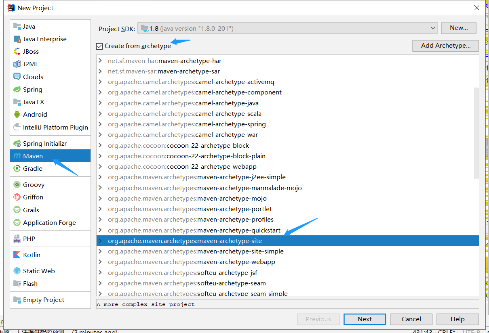
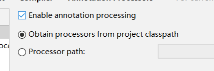
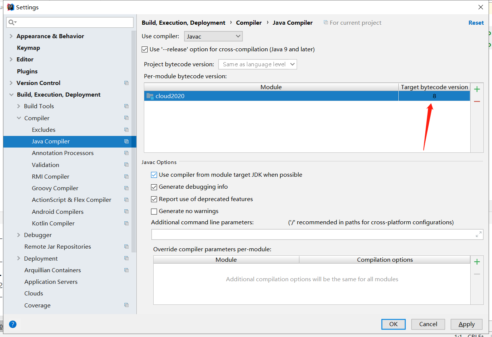
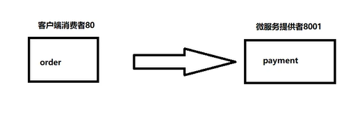
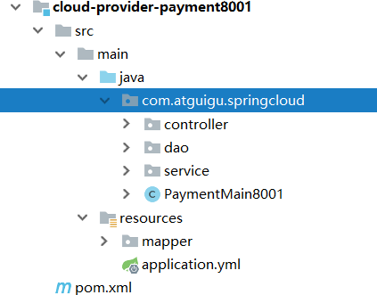

# 尚硅谷SpringCloud-Alibaba(三)-项目搭建

调完settings里面utf-8  

-----

settings->build,execution,deployment->annotation processors打勾  
Enable annotation processing (启用注释处理)  

-----

java compiler 这里改为 8  

-----

创建项目7要素  

1.建立module  
2.改POM  
3.写YML  
4.主启动  
5.业务类  
6.测试  
7.总结  

上图是常见的RESTful API风格 80端口调用微服务8001端口的逻辑层  

