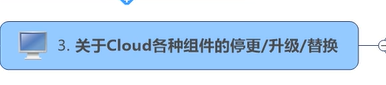
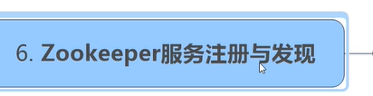
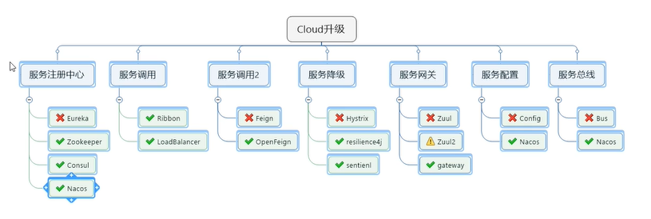

# 尚硅谷SpringCloud-Alibaba(二)-技术选型

springcloud还是面临组件停更问题

> 服务注册中心

eureka:停更  

替代者:zookeeper  

完美替换的:Nacos  [https://nacos.io/zh-cn/](https://nacos.io/zh-cn/)

---------

> 服务调用  

Ribbon  
后续官方会推  
LoadBalancer

--------

> 服务调用2

Fegin:几乎不用再关注了  
替代:OpenFegin  

-------

>服务降级  

Hystrix:停更  
替代:resilience4j  [https://github.com/resilience4j/resilience4j](https://github.com/resilience4j/resilience4j)    
[https://baijiahao.baidu.com/s?id=1655117193416193858&wfr=spider&for=pc](https://baijiahao.baidu.com/s?id=1655117193416193858&wfr=spider&for=pc)  
国外用resilience4j的比较多  

国内替代:springcloud alibaba sentinel  
  

-----

> 服务网关

Zuul:停更  
替代:gateway  

------

> 服务配置

Config:不是完全停更  
替代:Nacos  [https://nacos.io/zh-cn/](https://nacos.io/zh-cn/)   

-----

> 服务总线

Bus:不再使用  
替代:Nacos  [https://nacos.io/zh-cn/](https://nacos.io/zh-cn/)

