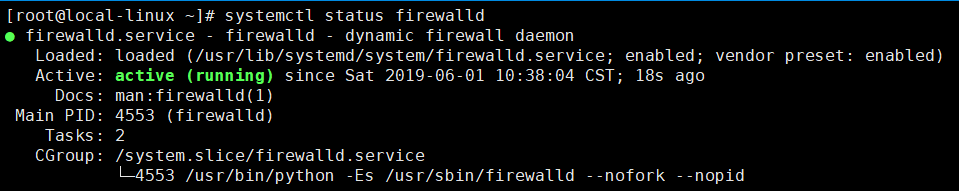

## 系统服务管理
### systemctl

```
systemctl命令是service和chkconfig命令的组合体，可用于管理系统。
```

+ 输出系统中各个服务的状态：

```
systemctl list-units --type=service
```


+ 查看服务的运行状态：

```
systemctl status firewalld
```


+ 关闭服务：

```
systemctl stop firewalld
```


+ 启动服务：

```
systemctl start firewalld
```


+ 重新启动服务（不管当前服务是启动还是关闭）：

```
systemctl restart firewalld
```

+ 重新载入配置信息而不中断服务：

```
systemctl reload firewalld
```

+ 禁止服务开机自启动：

```
systemctl disable firewalld
```


+ 设置服务开机自启动：

```
systemctl enable firewalld
```


## 文件管理

### ls

+ 列出指定目录下的所有文件，列出`/`目录下的文件：  

```
ls -l /
```


### pwd
+ 获取目前所在工作目录的绝对路径：


### cd

+ 改变当前工作目录：

```
cd /usr/local
```


### date

+ 显示或修改系统时间与日期；

```
date '+%Y-%m-%d %H:%M:%S'
```


### passwd

+ 用于设置用户密码：

```
passwd root
```


### su

+ 改变用户身份（切换到超级用户）：

```
su -
```

### clear

+ 用于清除屏幕信息

### man

+ 显示指定命令的帮助信息：

```
man ls
```

### who

+ 查询系统处于什么运行级别：

```
who -r
```


+ 显示目前登录到系统的用户：

```
who -buT
```


### free

+ 显示系统内存状态（单位MB）：

```
free -m
```


### ps

+ 显示系统进程运行动态：

```
ps -ef
```

+ 查看sshd进程的运行动态：

```
ps -ef | grep sshd
```


### top

+ 查看即时活跃的进程，类似Windows的任务管理器。


### mkdir

+ 创建目录：


### more

+ 用于分页查看文件，例如每页10行查看boot.log文件：

```
more -c -10 /var/log/boot.log
```


### cat

+ 用于查看文件，例如查看Linux启动日志文件文件，并标明行号：

```
cat -Ab /var/log/boot.log
```


### touch

+ 用于创建文件，例如创建text.txt文件：

```
touch text.txt
```


### rm

+ 删除文件：

```
rm text.txt
```

+ 强制删除某个目录及其子目录：

```
rm -rf testdir/
```


### cp

+ 用于拷贝文件，例如将test1目录复制到test2目录

```
cp -r /mydata/tes1 /mydata/test2
```

### mv

+ 用于移动或覆盖文件：

```
mv text.txt text2.txt
```

## 压缩与解压

### tar

+ 将/etc文件夹中的文件归档到文件etc.tar（并不会进行压缩）：

```
tar -cvf /mydata/etc.tar /etc
```

+ 用gzip压缩文件夹/etc中的文件到文件etc.tar.gz：

```
tar -zcvf /mydata/etc.tar.gz /etc
```


+ 用bzip2压缩文件夹/etc到文件/etc.tar.bz2：

```
tar -jcvf /mydata/etc.tar.bz2 /etc
```


+ 分页查看压缩包中内容（gzip）：

```
tar -ztvf /mydata/etc.tar.gz |more -c -10
```

+ 解压文件到当前目录（gzip）：

```
tar -zxvf /mydata/etc.tar.gz
```

+解压文件到指定目录（gzip）：

```
tar -zxvf /mydata/etc.tar.gz -C /mydata/etc
```

## 磁盘和网络管理

### df

+ 查看磁盘空间占用情况：

```
df -hT
```


### dh


+ 查看当前目录下的文件及文件夹所占大小：

```
du -h --max-depth=1 ./*
```


### ifconfig

+ 显示当前网络接口状态：


### netstat

+ 查看当前路由信息：

```
netstat -rn
```


+ 查看所有有效TCP连接：

```
netstat -an
```

+ 查看系统中启动的监听服务：

```
netstat -tulnp
```


+ 查看处于连接状态的系统资源信息：

```
netstat -atunp
```

### wget

+ 从网络上下载文件


## 文件上传下载

+ 安装上传下载工具lrzsz；

```
yum install -y lrzsz
```

+ 上传文件，输入以下命令XShell会弹出文件上传框；

```
rz
```

+ 下载文件，输入以下命令XShell会弹出文件保存框；

```
sz fileName
```

## 软件的安装与管理

### rpm

+ RPM是Red-Hat Package Manager的缩写，一种Linux下通用的软件包管理方式，可用于安装和管理.rpm结尾的软件包。

+安装软件包：

```
rpm -ivh nginx-1.12.2-2.el7.x86_64.rpm
```

+模糊搜索软件包：

```
rpm -qa | grep nginx
```

+ 精确查找软件包：

```
rpm -qa nginx
```

+ 查询软件包的安装路径：

```
rpm -ql nginx-1.12.2-2.el7.x86_64
```

+ 查看软件包的概要信息：

```
rpm -qi nginx-1.12.2-2.el7.x86_64
```

+ 验证软件包内容和安装文件是否一致：

```
rpm -V nginx-1.12.2-2.el7.x86_64
```

+ 更新软件包：

```
rpm -Uvh nginx-1.12.2-2.el7.x86_64
```

+ 删除软件包：

```
rpm -e nginx-1.12.2-2.el7.x86_64
```

### yum

> Yum是Yellow dog Updater, Modified的缩写，能够在线自动下载RPM包并安装，可以自动处理依赖性关系，并且一次安装所有依赖的软件包，非常方便！

+ 安装软件包： 

```
yum install nginx
```

+ 检查可以更新的软件包：

```
yum check-update
```

+ 更新指定的软件包：

```
yum update nginx
```

+ 在资源库中查找软件包信息：

```
yum info nginx*
```

+ 列出已经安装的所有软件包：

```
yum info installed
```

+ 列出软件包名称：

```
yum list nginx*
```

+ 模糊搜索软件包：

```
yum search nginx
```
