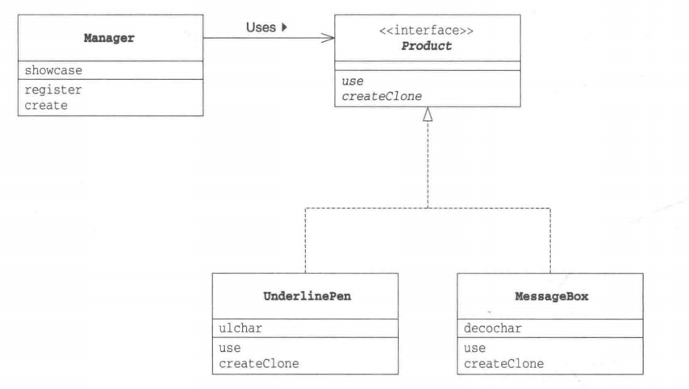
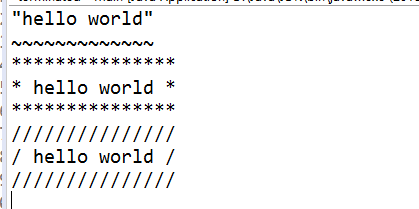
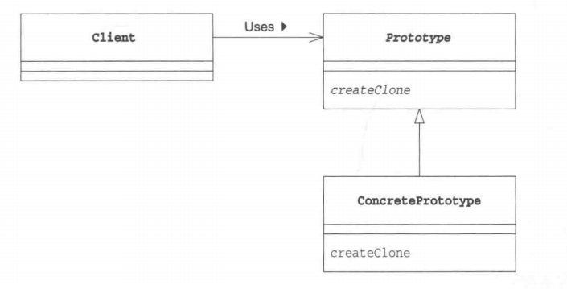

# 深入理解原型模式 ——通过复制生成实例
转载于: [https://blog.csdn.net/qq_34337272/article/details/80706444](https://blog.csdn.net/qq_34337272/article/details/80706444)

# 一 原型模式介绍

在面向对象系统中，使用原型模式来复制一个对象自身，从而克隆出多个与原型对象一模一样的对象。  

另外在软件系统中，有些对象的创建过程较为复杂，而且有时候需要频繁创建，原型模式通过给出一个原型对象来指明所要创建的对象的类型，然后用复制这个原型对象的办法创建出更多同类型的对象，这就是原型模式的意图所在。  


## 1.1 定义
**GOF给出的原型模式定义如下：**  

> `Specify the kind of objects to create using a prototypical instance, and create new objects by copying this prototype. （使用原型实例指定将要创建的对象类型，通过复制这个实例创建新的对象。）`

## 1.2 原型模式适用场景

我们现在一般会使用new关键字指定类名生成类的实例（PS：我们以前使用<font color=#dc0e89 >java.lang.Cloneable</font>的一个很大原因是使用new创建对象的速度相对来说会慢一些，随着JVM性能的提升，new的速度和Object的<font color=#dc0e89 >clone（）方法</font>的速度差不多了。）。  

使用new关键字创建类的时候必须指定类名，但是在开发过程中也会有“在不指定类名的前提下生成实例”的需求。例如，在下面这些情况下，就需要根据现有的实例来生成新的实例  

**1) 对象种类繁多，无法将他们整合到一个类的时候；**  

**2) 难以根据类生成实例时；**  

**3) 想解耦框架与生成的实例时。**

如果想要让生成实例的框架不再依赖于具体的类，这时，不能指定类名来生成实例，而要事先“注册”一个“原型”实例，然后通过复制该实例来生成新的实例。  

## 1.3 模式分析

在原型模式结构中定义了一个抽象原型类，所有的Java类都继承自<font color=#dc0e89 >java.lang.Object</font>，而Object类提供一个<font color=#dc0e89 >clone()方法</font>，可以将一个Java对象复制一份。因此在Java中可以直接使用Object提供的clone()方法来实现对象的克隆，Java语言中的原型模式实现很简单。  

能够实现克隆的Java类必须实现一个标识<font color=#dc0e89 >接口Cloneable</font>，表示这个Java类支持复制。如果一个类没有实现这个接口但是调用了<font color=#dc0e89 >clone()方法</font>，Java编译器将抛出一个<font color=#dc0e89 >CloneNotSupportedException</font>异常。  

**注意： `java.lang.Cloneable` 只是起到告诉程序可以调用clone方法的作用，它本身并没有定义任何方法。**  

在使用原型模式克隆对象时，**根据其成员对象是否也克隆**，原型模式可以分为两种形式：**深克隆** 和 **浅克隆** 。  

## 1.4 模式优缺点分析
**原型模式的优点：**  
+ 当创建新的对象实例较为复杂时，使用原型模式可以简化对象的创建过程，通过一个已有实例可以提高新实例的创建效率。  
+ 可以动态增加或减少产品类。  
+ 原型模式提供了简化的创建结构。  
+ 可以使用深克隆的方式保存对象的状态。  

**原型模式的缺点：**

+ 需要为每一个类配备一个克隆方法，而且这个克隆方法需要对类的功能进行通盘考虑，这对全新的类来说不是很难，但对已有的类进行改造时，不一定是件容易的事，必须修改其源代码，违背了“开闭原则”。  
+ 在实现深克隆时需要编写较为复杂的代码。  

# 二 示例程序

下面示例程序的作用是将字符串放入方框中显示出来或者是加了下划线显示出来。  

**类和接口一览表：**  
  

示例程序类图：  
  

## 2.1 Product接口 （Prototype）

`Product接口`是复制功能接口，该接口继承了`java.lang.Cloneable`(只有实现了该接口的类的实例才可以调用`clone()方法`复制实例,否则会抛出异常).  
另外需要注意：`java.lang.Cloneable` **只是起到告诉程序可以调用clone方法的作用，它本身并没有定义任何方法。**  
```java
package prototype_pattern;

public interface Product extends Cloneable{
   //use方法是用于“使用”的方法，具体怎么“使用”，则被交给子类去实现。
    public abstract void use(String s);
    //creatClone方法是用于复制实例的方法
    public abstract Product creatClone();

}
```
 
## 2.2 Manager类（Client）

Manager类使用Product接口来复制实例。  

`Product接口`以及`Manager类`的代码完全没有出现在`MessageBox类`和`UnderlinePen类`的名字，因此这意味着我们可以独立地修改`Product接口`以及`Manager类`，不受`MessageBox类`和`UnderlinePen类`的影响。这是非常重要的，因为 **一旦在类中使用到了别的类名，就意味着该类与其他类紧密的地耦合在了一起** 。在`Manager类`中，并没有写明具体的类名， 仅仅使用了`Product`这个接口名。也就是说，`Product接口`成为了连接`Manager类`与其他具体类之间的桥梁。  

```java
package prototype_pattern;

import java.util.HashMap;

public class Manager {
    //保存实例的“名字”和“实例”之间的对应关系
    private HashMap<String, Product> showcase=new HashMap<String, Product>();
    //register方法将接收到的一组“名字”和“Product接口”注册到showcase中。这里Product是实现Product接口的实例，具体还未确定
    public void register(String name ,Product product){
        showcase.put(name, product);
    }
    public Product create(String productname){
        Product p=showcase.get(productname);
        return p.creatClone();
    }

}
```
## 2.3 MessageBox类（ConcreteProtorype）

装饰方框样式的具体原型，实现了`Product接口`，实现复制现有实例并生成新实例的方法。
```java
package prototype_pattern;

public class MessageBox implements Product {
    //保存的是装饰方框使用的字符样式
    private char decochar;

    public MessageBox(char decochar) {
        this.decochar = decochar;
    }

    @Override
    public void use(String s) {
     int length=s.getBytes().length;
     for (int i = 0; i < length+4; i++) {
            System.out.print(decochar); 
    }
     System.out.println("");
     System.out.println(decochar+" "+s+" "+decochar);
     for (int i = 0; i < length+4; i++) {
        System.out.print(decochar);
    }
     System.out.println("");
    }

    //该方法用于复制自己
    @Override
    public Product creatClone() {
        Product p=null;
        try {
            p=(Product) clone();
        } catch (CloneNotSupportedException e) {
            e.printStackTrace();
        }
        return p;
    }

}
```

只有类自己（或是它的子类）能够调用Java语言中定义的clone方法。当其他类要求复制实例时，必须先调用createClone这样的方法，然后在该方法内部在调用clone方法。    

## 2.4 UnderlinePen类（ConcreteProtorype）

下划线样式的具体原型，实现了`Product接口`，用于实现复制现有实例并生成新实例的方法。`UnderlinePen类`的实现几乎和`MessageBox类`一样，不同的可能只是`use方法`的实现。

```java
package prototype_pattern;

public class UnderlinePen implements Product {

    private char ulchar;

    public UnderlinePen(char ulchar) {
        this.ulchar = ulchar;
    }

    @Override
    public void use(String s) {
        int length = s.getBytes().length;
        System.out.println("\""+s+"\"");
        for (int i = 0; i <length+2; i++) {
            System.out.print(ulchar);

        }
        System.out.println("");
    }

    @Override
    public Product creatClone() {
        Product p=null;
        try {
            p=(Product) clone();
        } catch (CloneNotSupportedException e) {
            e.printStackTrace();
        }
        return p;
    }

}
```
## 2.5 Main类

`Main类`首先生成Manager实例。接着，在`Manager实例`中通过`register方法`注册了`UnderlinePen类`的实例（带名字）和`MessageBox类`的实例（带名字）。  

```java
package prototype_pattern;

public class Main {

    public static void main(String[] args) {
        Manager manager = new Manager();
        UnderlinePen underlinePen=new UnderlinePen('~');
        MessageBox mbox=new MessageBox('*');
        MessageBox sbox=new MessageBox('/');
        manager.register("Strong message", underlinePen);
        manager.register("Waring Box", mbox);
        manager.register("Slash Box", sbox);
        Product p1=manager.create("Strong message");
        p1.use("hello world");
        Product p2=manager.create("Waring Box");
        p2.use("hello world");
        Product p3=manager.create("Slash Box");
        p3.use("hello world");
    }

}
```
**运行结果：**
  

# 三 原型模式的角色分析

通过上面的例子，相信大家对于原型模式有了更进一步的认识，下面我们看看原型模式的几个登场角色。  

## 3.1 Prototype（抽象原型类）

Product角色负责定义用于复制现有实例来生成新实例的方法。在示例程序中的Product接口就是该角色。  

## 3.2 ConcretePrototype（具体原型类）

ConcretePrototype角色负责实现复制现有实例并生成新实例的方法。在示例程序中，MessageBox和UnderlinePen都是该角色。  

## 3.3 Client（客户类/使用者）

Client角色负责使用复制实例的方法生成新的实例。在示例程序中，Manager类扮演的就是该角色。  

**Prototype模式的类图：**


# 四 原型模式的实际应用案例

(1) 原型模式应用于很多软件中，如果每次创建一个对象要花大量时间，原型模式是最好的解决方案。很多软件提供的`复制(Ctrl + C)`和`粘贴(Ctrl + V)`操作就是原型模式的应用，复制得到的对象与原型对象是两个类型相同但内存地址不同的对象，通过原型模式可以大大提高对象的创建效率。  

(2) 在`Struts2`中为了保证线程的安全性，`Action对象`的创建使用了原型模式，访问一个已经存在的`Action对象`时将通过克隆的方式创建出一个新的对象，从而保证其中定义的变量无须进行加锁实现同步，每一个`Action`中都有自己的成员变量，避免`Struts1`因使用单例模式而导致的并发和同步问题。  

(3) 在`Spring`中，用户也可以采用原型模式来创建新的`bean实例`，从而实现每次获取的是通过克隆生成的新实例，对其进行修改时对原有实例对象不造成任何影响。  

# 五 总结

本文主要介绍了：什么是原型模式、原型模式的优缺点以及使用场景。另外，简单介绍了深拷贝和浅拷贝以及原型模式的实际应用案例。  
