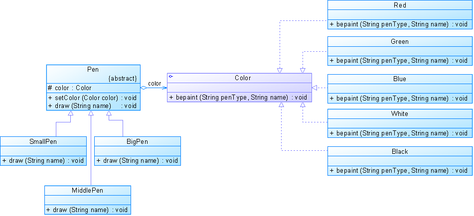
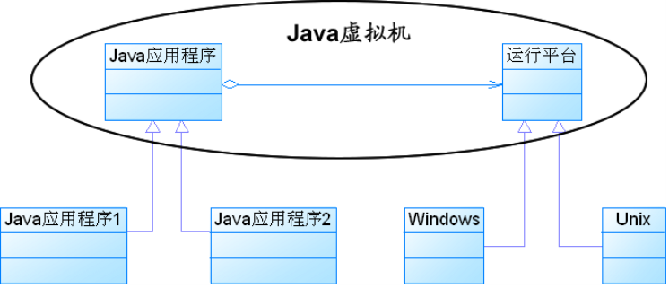

# 设计模式笔记16：桥接模式(Bridge Pattern)
转载于: [https://blog.csdn.net/yangzl2008/article/details/7670996](https://blog.csdn.net/yangzl2008/article/details/7670996)


# 一、桥接模式的内容  
桥接模式(Bridge Pattern)：将抽象部分与它的实现部分分离，使它们都可以独立地变化。它是一种对象结构型模式，又称为柄体(Handle and Body)模式或接口(Interface)模式。  

桥接模式将继承关系转换为关联关系，从而降低了类与类之间的耦合，减少了代码编写量。  

## 桥梁模式的用意

【GOF95】在提出桥梁模式的时候指出，桥梁模式的用意是"将抽象化(Abstraction)与实现化(Implementation)脱耦，使得二者可以独立地变化"。这句话有三个关键词，也就是抽象化、实现化和脱耦。`将类与类之间继承的关系，变为抽象类或者接口与接口之间的关联关系，实现了抽象化与实现化的脱耦。`

## 抽象化

存在于多个实体中的共同的概念性联系，就是抽象化。作为一个过程，抽象化就是忽略一些信息，从而把不同的实体当做同样的实体对待【LISKOV94】。  

## 实现化

抽象化给出的具体实现，就是实现化。  

## 脱耦

所谓耦合，就是两个实体的行为的某种强关联。而将它们的强关联去掉，就是耦合的解脱，或称脱耦。在这里，脱耦是指将抽象化和实现化之间的耦合解脱开，或者说是将它们之间的强关联改换成弱关联。  

将两个角色之间的继承关系改为聚合关系，就是将它们之间的强关联改换成为弱关联。因此，桥梁模式中的所谓脱耦，就是指在一个软件系统的抽象化和实现化之间使用组合/聚合关系而不是继承关系，从而使两者可以相对独立地变化。这就是桥梁模式的用意。  


# 二、 桥梁模式的结构
桥梁模式【GOF95】是对象的结构模式，又称为柄体(Handle and Body)模式或接口(Interface)模式。  

下图所示就是一个实现了桥梁模式的示意性系统的结构图。  


**可以看出，这个系统含有两个等级结构，也就是：**  

+ 由抽象化角色和修正抽象化角色组成的抽象化等级结构。
+ 由实现化角色和两个具体实现化角色所组成的实现化等级结构。

**桥梁模式所涉及的角色有：**

+ `抽象化(Abstraction)角色`：抽象化给出的定义，并保存一个对实现化对象的引用。
+ `修正抽象化(Refined Abstraction)角色`：扩展抽象化角色，改变和修正父类对抽象化的定义。
+ `实现化(Implementor)角色`：这个角色给出实现化角色的接口，但不给出具体的实现。必须指出的是，这个接口不一定和抽象化角色的接口定义相同，实际上，这两个接口可以非常不一样。实现化角色应当只给出底层操作，而抽象化角色应当只给出基于底层操作的更高一层的操作。
具体实现化(Concrete Implementor)角色：这个角色给出实现化角色接口的具体实现。
# 三、桥接模式示例代码
代码一、

```
java
public interface Implementor
{
	public void operationImpl();
}
 
public class ConcreteImplementor implements Implementor
{
	public void operationImpl()
	{
		//具体实现
	}
}
 
public abstract class Abstraction
{
	protected Implementor impl;
	
	public void setImpl(Implementor impl)
	{
		this.impl=impl;
	}
	
	public abstract void operation();
}
 
public class RefinedAbstraction extends Abstraction
{
	public void operation()
	{
		//代码
		impl.operationImpl();
		//代码
	}
}
```
代码二、


```java
public interface Color
{
	void bepaint(String penType,String name);
}
```

```java
public abstract class Pen
{
	protected Color color;
	public void setColor(Color color)
	{
		this.color=color;
	}
	public abstract void draw(String name);
} 
```

```java
public class SmallPen extends Pen
{
	public void draw(String name)
	{
		String penType="小号毛笔绘制";
		this.color.bepaint(penType,name);			
	}	
}
```

```java
public class MiddlePen extends Pen
{
	public void draw(String name)
	{
		String penType="中号毛笔绘制";
		this.color.bepaint(penType,name);			
	}	
}
```

```java
public class BigPen extends Pen
{
	public void draw(String name)
	{
		String penType="大号毛笔绘制";
		this.color.bepaint(penType,name);			
	}	
}
```

```java
public class Green implements Color
{
	public void bepaint(String penType,String name)
	{
		System.out.println(penType + "绿色的"+ name + ".");
	}
}
```

```java
public class Red implements Color
{
	public void bepaint(String penType,String name)
	{
		System.out.println(penType + "红色的"+ name + ".");
	}
}
```

```java
public class White implements Color
{
	public void bepaint(String penType,String name)
	{
		System.out.println(penType + "白色的"+ name + ".");
	}
}
```

```java
public class Black implements Color
{
	public void bepaint(String penType,String name)
	{
		System.out.println(penType + "黑色的"+ name + ".");
	}
}
```

```java
public class Blue implements Color
{
	public void bepaint(String penType,String name)
	{
		System.out.println(penType + "蓝色的"+ name + ".");
	}
}
```

```xml
<?xml version="1.0"?>
<config>
    <className>Blue</className>
    <className>SmallPen</className>
</config>
```

```java
import javax.xml.parsers.*;
import org.w3c.dom.*;
import org.xml.sax.SAXException;
import java.io.*;
public class XMLUtilPen
{
//该方法用于从XML配置文件中提取具体类类名，并返回一个实例对象
	public static Object getBean(String args)
	{
		try
		{
			//创建文档对象
			DocumentBuilderFactory dFactory = DocumentBuilderFactory.newInstance();
			DocumentBuilder builder = dFactory.newDocumentBuilder();
			Document doc;							
			doc = builder.parse(new File("configPen.xml")); 
			NodeList nl=null;
			Node classNode=null;
			String cName=null;
			nl = doc.getElementsByTagName("className");
			
			if(args.equals("color"))
			{
				//获取包含类名的文本节点
	            classNode=nl.item(0).getFirstChild();
	            
			}
			else if(args.equals("pen"))
			{
			   //获取包含类名的文本节点
	            classNode=nl.item(1).getFirstChild();
			}
			
	         cName=classNode.getNodeValue();
	         //通过类名生成实例对象并将其返回
	         Class c=Class.forName(cName);
		  	 Object obj=c.newInstance();
	         return obj;		
           }   
           	catch(Exception e)
           	{
           		e.printStackTrace();
           		return null;
           	}
		}
}
```

```java
public class Client
{
	public static void main(String a[])
	{
		Color color;
		Pen pen;
		
		color=(Color)XMLUtilPen.getBean("color");
		pen=(Pen)XMLUtilPen.getBean("pen");
		
		pen.setColor(color);
		pen.draw("鲜花");
	}
}
```

# 四、桥接模式分析
理解桥接模式，重点需要理解如何将抽象化(Abstraction)与实现化(Implementation)脱耦，使得二者可以独立地变化。  

+ **抽象化**：抽象化就是忽略一些信息，把不同的实体当作同样的实体对待。在面向对象中，将对象的共同性质抽取出来形成类的过程即为抽象化的过程。   
+ **实现化**：针对抽象化给出的具体实现，就是实现化，抽象化与实现化是一对互逆的概念，实现化产生的对象比抽象化更具体，是对抽象化事物的进一步具体化的产物。  
+ **脱耦**：脱耦就是将抽象化和实现化之间的耦合解脱开，或者说是将它们之间的强关联改换成弱关联，将两个角色之间的继承关系改为关联关系。桥接模式中的所谓脱耦，就是指在一个软件系统的抽象化和实现化之间使用关联关系（组合或者聚合关系）而不是继承关系，从而使两者可以相对独立地变化，这就是桥接模式的用意。   
# 五、桥接模式优缺点
## 桥接模式的优点
+ 分离抽象接口及其实现部分。   
+ 桥接模式有时类似于多继承方案，但是多继承方案违背了类的单一职责原则（即一个类只有一个变化的原因），复用性比较差，而且多继承结构中类的个数非常庞大，桥接模式是比多继承方案更好的解决方法。    
+ 桥接模式提高了系统的可扩充性，在两个变化维度中任意扩展一个维度，都不需要修改原有系统。   
+ 实现细节对客户透明，可以对用户隐藏实现细节。   
+ 桥接模式的缺点  
+ 桥接模式的引入会增加系统的理解与设计难度，由于聚合关联关系建立在抽象层，要求开发者针对抽象进行设计与编程。  
+ 桥接模式要求正确识别出系统中两个独立变化的维度，因此其使用范围具有一定的局限性。  

# 六、桥接模式适用环境
在以下情况下可以使用桥接模式： 
＋　如果一个系统需要在构件的抽象化角色和具体化角色之间增加更多的灵活性，避免在两个层次之间建立静态的继承联系，通过桥接模式可以使它们在抽象层建立一个关联关系。　　
＋　抽象化角色和实现化角色可以以继承的方式独立扩展而互不影响，在程序运行时可以动态将一个抽象化子类的对象和一个实现化子类的对象进行组合，即系统需要对抽象化角色和实现化角色进行动态耦合。　　
＋　一个类存在两个独立变化的维度，且这两个维度都需要进行扩展。　　
＋　虽然在系统中使用继承是没有问题的，但是由于抽象化角色和具体化角色需要独立变化，设计要求需要独立管理这两者。　　
＋　对于那些不希望使用继承或因为多层次继承导致系统类的个数急剧增加的系统，桥接模式尤为适用。　　

# 七、桥接模式应用
(1) Java语言通过Java虚拟机实现了平台的无关性。
  

(2) 一个 Java桌面软件总是带有所在操作系统的视感(LookAndFeel)，如果一个Java软件是在Unix系统上开发的，那么开发人员看到的是Motif用户界面的视感；在Windows上面使用这个系统的用户看到的是Windows用户界面的视感；而一个在Macintosh上面使用的用户看到的则是Macintosh用户界面的视感，Java语言是通过所谓的Peer架构做到这一点的。Java为AWT中的每一个GUI构件都提供了一个Peer构件，在AWT中的Peer架构就使用了桥接模式。   
(3) JDBC驱动程序也是桥接模式的应用之一。使用JDBC驱动程序的应用系统就是抽象角色，而所使用的数据库是实现角色。一个JDBC驱动程序可以动态地将一个特定类型的数据库与一个Java应用程序绑定在一起，从而实现抽象角色与实现角色的动态耦合。  
`Bridge (recognizeable by creational methods taking an instance of different abstract/interface type and returning an implementation of own abstract/interface type which delegates/uses the given instance)`  

+ `None comes to mind yet. A fictive example would be new LinkedHashMap(LinkedHashSet<K>, List<V>) which returns an unmodifiable linked map which doesn't clone the items, but uses them. The java.util.Collections#newSetFromMap() and singletonXXX() methods however comes close.`