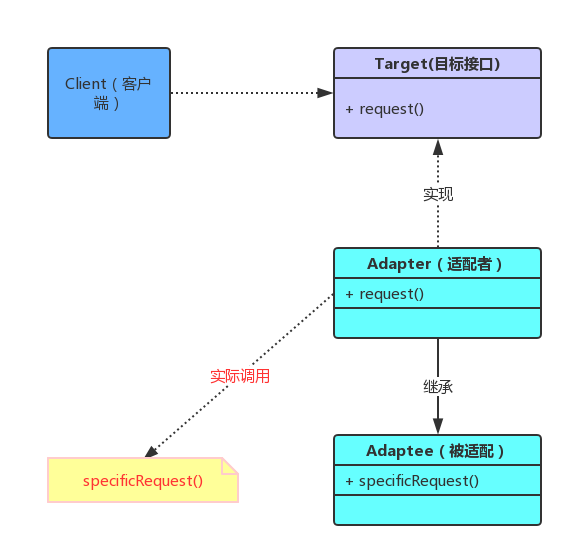

><font color=#dc0e89 >适配器模式（Adapter Pattern）</font>属于<font color=#dc0e89 >结构型模式</font>的一种，把一个类的接口变成客户端所期待的另一种接口，从而使原本接口不匹配而无法一起工作的两个类能够在一起工作 

# 概述
当你想使用一个已经存在的类，而它的接口不符合你的需求，或者你想创建一个可重用的类（与不兼容接口无关的类），这时候可以考虑使用<font color=#dc0e89 >适配器模式</font>。同时它也是一种包装模式，它与<font color=#dc0e89 >装饰模式</font>同样具有包装的功能 



# 案例
笔者算是小米的忠实用户了，从大学期间起至今都是购买的小米，期间发现小米5在推出的时候，它会送一个type-c的转接口给我们，那会type-c数据线应该还不算普及，这种做法还是蛮好的，在使用转接口后Micro USB得以重复利用，这样一来即使原装的米5数据线丢了也没关系，只要有type-c转接口，一样可以用Micro USB充电/连接电脑 

# 类适配器
1.首先定义<font color=#dc0e89 >M4DataLine</font> 代表是<font color=#dc0e89 >Micro USB</font>，我们目的就是通过适配器能够用米4数据线连接米5手机

```java
class M4DataLine {
    public void connection() {
        System.out.println("使用小米4数据线连接...");
    }
}

```
2.定义客户端使用的接口，与业务相关
```java
interface Target {
    void connection();
}

class M5DataLine implements Target {
    @Override
    public void connection() {
        System.out.println("使用小米5数据线连接...");
    }
}
```
3.创建适配器类，继承了被适配类，同时实现标准接口 
```java
class M5DataLineAdapter extends M4DataLine implements Target {

    @Override
    public void connection() {
        System.out.println("插入 type-c 转接头");
        super.connection();
    }
}
```
4.客户端代码，测试 
```java
public class AdapterMain {

    public static void main(String[] args) {
        Target target = new M5DataLine();
        target.connection();

        Target adapter = new M5DataLineAdapter();
        adapter.connection();
    }
}
```
5.结果
```
使用小米5数据线连接...
插入 type-c 转接头
使用小米4数据线连接...
```

# 对象适配器
创建适配器类，实现标准接口，将这个调用委托给实现新接口的对象来处理
```java
class M5DataLineAdapter implements Target {

    private Target target;

    public M5DataLineAdapter(Target target) {
        this.target = target;
    }

    @Override
    public void connection() {
        System.out.println("插入 type-c 转接头");
        target.connection();
    }
}

public class AdapterMain {

    public static void main(String[] args) {
        // 使用特殊功能类，即适配类
        Target adapter = new M5DataLineAdapter(new M5DataLine());
        adapter.connection();
    }
}
```
# 区别
类适配器：对象继承的方式，静态的定义。 

对象适配器：依赖于对象的组合，都是采用对象组合的方式，也就是对象适配器实现的方式。 

# JDK 中的适配器使用 

使用适配器模式的类 
```
java.util.Arrays#asList()
java.io.InputStreamReader(InputStream)
java.io.OutputStreamWriter(OutputStream)
```

Java I/O 库大量使用了适配器模式，如 <font color=#dc0e89 >ByteArrayInputStream</font> 是一个适配器类，它继承了 <font color=#dc0e89 >InputStream</font> 的接口，并且封装了一个 byte 数组。换言之，它将一个 byte 数组的接口适配成 InputStream 流处理器的接口。 

在 <font color=#dc0e89 >OutputStream</font> 类型中，所有的原始流处理器都是适配器类。<font color=#dc0e89 >ByteArrayOutputStream</font> 继承了 <font color=#dc0e89 >OutputStream</font> 类型，同时持有一个对 byte 数组的引用。它一个 byte 数组的接口适配成 OutputString 类型的接口，因此也是一个对象形式的适配器模式的应用。 

<font color=#dc0e89 >FileOutputStream</font> 继承了 <font color=#dc0e89 >OutputStream</font> 类型，同时持有一个对 <font color=#dc0e89 >FileDiscriptor</font> 对象的引用。这是一个将 <font color=#dc0e89 >FileDiscriptor</font> 接口适配成 <font color=#dc0e89 >OutputStream</font> 接口形式的对象型适配器模式。 

<font color=#dc0e89 >Reader</font> 类型的原始流处理器都是适配器模式的应用。<font color=#dc0e89 >StringReader</font> 是一个适配器类，<font color=#dc0e89 >StringReader</font> 类继承了 <font color=#dc0e89 >Reader</font> 类型，持有一个对 String 对象的引用。它将 String 的接口适配成 <font color=#dc0e89 >Reader</font> 类型的接口。

# Spring 中使用适配器模式的典型应用 
在 Spring 的 AOP 里通过使用的 Advice（通知）来增强被代理类的功能。 

Spring 实现这一 AOP 功能的原理就使用代理模式（1、JDK 动态代理。2、CGLib 字节码生成技术代理。）对类进行方法级别的切面增强，即，生成被代理类的代理类，并在代理类的方法前，设置拦截器，通过执行拦截器中的内容增强了代理方法的功能，实现的面向切面编程。 
    
Advice（通知）的类型有：BeforeAdvice、AfterReturningAdvice、ThrowSadvice 等。每个类型 Advice（通知）都有对应的拦截器，MethodBeforeAdviceInterceptor、AfterReturningAdviceInterceptor、ThrowsAdviceInterceptor。Spring 需要将每个 Advice（通知）都封装成对应的拦截器类型，返回给容器，所以需要使用适配器模式对 Advice 进行转换。 

```java
public interface MethodBeforeAdvice extends BeforeAdvice {
    void before(Method method, Object[] args, Object target) throws Throwable;
}

public interface AdvisorAdapter {

    boolean supportsAdvice(Advice advice);

    MethodInterceptor getInterceptor(Advisor advisor);
}

class MethodBeforeAdviceAdapter implements AdvisorAdapter, Serializable {

    @Override
    public boolean supportsAdvice(Advice advice) {
        return (advice instanceof MethodBeforeAdvice);
    }

    @Override
    public MethodInterceptor getInterceptor(Advisor advisor) {
        MethodBeforeAdvice advice = (MethodBeforeAdvice) advisor.getAdvice();
        return new MethodBeforeAdviceInterceptor(advice);
    }

}
```
默认的适配器注册表 
```java
public class DefaultAdvisorAdapterRegistry implements AdvisorAdapterRegistry, Serializable {

    private final List<AdvisorAdapter> adapters = new ArrayList<AdvisorAdapter>(3);

    public DefaultAdvisorAdapterRegistry() {
        // 注册适配器 
        registerAdvisorAdapter(new MethodBeforeAdviceAdapter());
        registerAdvisorAdapter(new AfterReturningAdviceAdapter());
        registerAdvisorAdapter(new ThrowsAdviceAdapter());
    }

    @Override
    public Advisor wrap(Object adviceObject) throws UnknownAdviceTypeException {
        if (adviceObject instanceof Advisor) {
            return (Advisor) adviceObject;
        }
        if (!(adviceObject instanceof Advice)) {
            throw new UnknownAdviceTypeException(adviceObject);
        }
        Advice advice = (Advice) adviceObject;
        if (advice instanceof MethodInterceptor) {
            // So well-known it doesn't even need an adapter.
            return new DefaultPointcutAdvisor(advice);
        }
        for (AdvisorAdapter adapter : this.adapters) {
            // 检查是否支持,这里调用了适配器的方法 
            if (adapter.supportsAdvice(advice)) {
                return new DefaultPointcutAdvisor(advice);
            }
        }
        throw new UnknownAdviceTypeException(advice);
    }

    @Override
    public MethodInterceptor[] getInterceptors(Advisor advisor) throws UnknownAdviceTypeException {
        List<MethodInterceptor> interceptors = new ArrayList<MethodInterceptor>(3);
        Advice advice = advisor.getAdvice();
        if (advice instanceof MethodInterceptor) {
            interceptors.add((MethodInterceptor) advice);
        }
        for (AdvisorAdapter adapter : this.adapters) {
            // 检查是否支持,这里调用了适配器的方法 
            if (adapter.supportsAdvice(advice)) {
                interceptors.add(adapter.getInterceptor(advisor));
            }
        }
        if (interceptors.isEmpty()) {
            throw new UnknownAdviceTypeException(advisor.getAdvice());
        }
        return interceptors.toArray(new MethodInterceptor[interceptors.size()]);
    }

    @Override
    public void registerAdvisorAdapter(AdvisorAdapter adapter) {
        this.adapters.add(adapter);
    }

}
```
# 总结
优点 
+ 可以让任何两个没有关联的类一起运行 
+ 提高了类的复用，想使用现有的类，而此类的接口标准又不符合现有系统的需要。通过适配器模式就可以让这些功能得到更好的复用。 
+ 增加了类的透明度，客户端只关注结果 
+ 使用适配器的时候，可以调用自己开发的功能，从而自然地扩展系统的功能。 

缺点
+ 过多使用会导致系统凌乱，追溯困难（内部转发导致，调用A适配成B）
适用场景
+ 系统需要使用一些现有的类，而这些类的接口（如方法名）不符合系统的需要，甚至没有这些类的源代码。
+ 想创建一个可以重复使用的类，用于与一些彼此之间没有太大关联的一些类，包括一些可能在将来引进的类一起工作。

小故事 
魏文王问名医扁鹊说：“你们家兄弟三人，都精于医术，到底哪一位最好呢？”
扁鹊答：“大哥最好，二哥次之，我最差。”
文王再问：“那么为什么你最出名呢？”
扁鹊答说：“我大哥治病，是治病于病情发作之前。由于一般人不知道他率先能铲除病因，所以他的名气无法传出去，只有我们家的人才知道。我二哥治病，是治病于病情初起之时。一般人以为他只能治轻微的小病，所以他的名气只及于本乡里。而我扁鹊治病，是治病于病情严重之时。一般人都看到我在经脉上穿针管来放血、在皮肤上敷药等大手术，所以以为我的医术高明，名气因此响遍全国。”
比较起来，能防范于未然是最高明的，但往往因防范在前，不会出现恶果，使事物保持了原态，没有“明显”的功绩而被忽略。正如不见防火英雄，只有救火英雄一样。高明者不见得一定名声显赫。
建议尽量使用对象的适配器模式，少用继承。适配器模式也是一种包装模式，它与装饰模式同样具有包装的功能，此外，<font color=#dc0e89 >对象适配器模式</font>还具有委托的意思。总的来说，**适配器模式属于补偿模式**，专门用来在系统后期扩展、修改时使用，但要注意不要过度使用适配器模式。


